# Branch Summarize + Handoff (issue #22)

Status: aligned. This spec records the design for `bin/compact --branch`,
which summarizes an abandoned rewind branch and appends it to the active path
as an additive marker. It supersedes the "one marker per open span" sketch in
issue #22. The decisions below were confirmed with the maintainer.

## 1. Episode and pre-test

Observed: in the TUI tree-browse flow, "Summarize the branch" and "Summarize
with a custom prompt" flash "pending kernel". The kernel has no way to
summarize an abandoned `rewind` span. `bin/compact` only compacts the active
prefix (`--up-to`). Nothing records what happened on a dropped branch.

Pre-test: this cannot be done in config or a script. It needs a new input on
`bin/compact` (a `--branch` mode) and an additive optional field
(`branch_of`) on `compaction_summary`. That is a protocol change. It also
needs a projection rule in `bin/assemble`.

## 2. Principles

- **P-A.** `handoff.md` covers the active context up to the compact timing.
  It is a boundary. It compacts the active prefix and becomes the new
  `first_kept`.
- **P-B.** A branch summary covers the context that became inactive after a
  switch. That is the abandoned open span of a rewind. It replaces nothing.
  The active path stays intact.
- **Corollary.** A branch marker is appended on the active path. It lives
  inside the active context. A later handoff naturally spans it.

So an upcoming handoff covers the range from the last handoff boundary to the
compact point. That range includes any branch markers already on the active
path.

## 3. Decisions (confirmed)

- **D1. `branch_of` is top-level only.** `branch_of` is the seq of the last
  (top-level) rewind marker on the active path. Sub-branches are not their
  own markers. They appear only as labels inside the summary text.
- **D2. Branch versioning is a single global counter.** There is one counter
  across all branch markers, not one per `branch_of`.
- **D3. The branch marker's `parent_version` is `0` (omitted).** A branch
  marker is not a handoff. It has no handoff parent. Its `diverge_seq` is set
  to `branch_of` so the DAG edge reads "diverged at the fork".

### Version namespaces

The two summaries use two independent version counters so their file
namespaces do not collide.

```mermaid
flowchart LR
  subgraph H["handoff namespace (counts handoff markers only)"]
    H1["HF v1 first_kept=5"] --> H2["HF v2 first_kept=9 (file exists)"]
  end
  subgraph B["branch namespace (counts branch markers only)"]
    B1["BR v1 branch_of=8"]
    B2["BR v2 branch_of=11"]
  end
  note["A BR sits on the active path. An HF region spans it. The counters stay independent."]
```



Consequences:

- `handoff_version_meta` counts only non-branch `compaction_summary` markers.
  A handoff `version` and `parent_version` never point at a branch marker.
- A branch marker's `version` comes from a branch counter (count of
  `branch_of` markers plus one). It is global, not per `branch_of`.
- `bin/compact` boundary selection skips `branch_of` markers. A branch
  sentinel `first_kept_seq=1` never resets a later handoff boundary.

## 4. Rollout (phased)

- **Phase 0, kernel, issue #22.** The `--branch` mechanism. It covers the
  per-branch labelled combine, the `branch_of` optional field, the two version
  counters, and branch-aware `bin/compact` plus `bin/assemble`. This makes the
  two no-op options work.
- **Phase 1, TUI visualization, intermediate, build first.** A read-only
  tree or DAG view of the log. It highlights the affected region for each of
  the existing four options. It shows the tree behavior without user-pick. No
  region-pick protocol and no new binary flags.
- **Phase 2, user-pick, deferred.** The user selects the branch span and the
  handoff region in the tree. That is the user taking over `assemble`
  region-pick for one step. It is deferred because it opens the biggest
  design gaps. Re-open it only with evidence from Phase 1.

### The four Phase-1 options and their highlighted regions

| # | Option | Affected region | Marker / file |
|---|--------|-----------------|---------------|
| 1 | **Summarize the branch**, default instruction | Ditched open span of the last rewind, the masked branch | Branch marker, `branch_of`=last rewind, `branch-summary/v<N>.md` |
| 2 | **Summarize with a custom prompt** | Same ditched open span, but the user text replaces the default instruction | Branch marker (custom), `branch-summary/v<N>.md` |
| 3 | **Manual compact (handoff)** | Active region from the last handoff boundary `first_kept` to the compact point, including branch markers | Handoff marker, `handoff.md` and `handoff/v<N>.md` |
| 4 | **Rewind without a summary** | Ditched open span dropped without a summary, shown masked | `rewind` marker only, no summary, no file |

Options 1 and 2 share the target region. Only the instruction differs.
Option 4 is the explicit "leave it unsummarized" path (D1 and the rewind UX).
Option 3 is the only one that writes into `handoff/`.

## Properties

Lean-style invariants for this spec (see `lean-driven-development.md`).
Each property is observable. It states an input and an output guarantee.

P1. additive-field-roundtrip: given a `compaction_summary` with an optional `branch_of`,
    observe a lossless serde round-trip and `v` still `1`.

P2. branch-marker-shape: given `bin/compact --branch` on a session with a non-empty open span,
    observe one appended `compaction_summary`. It sets `branch_of` to the last rewind seq, `first_kept_seq` to `1`, and `diverge_seq` to `branch_of`.

P3. branch-summary-file: given a successful `--branch` run,
    observe `branch-summary/v<N>.md` in the session dir with content equal to the inline `summary`. No write goes to `handoff/` or `handoff.md`.

P4. branch-failure: given a `--branch` run whose model call fails,
    observe an appended `compaction_failed` marker. No new `rewind` or branch marker is written.

P5. branch-version-global: given N markers carrying `branch_of`,
    observe the branch version counter return `N+1`. It is a single global counter, not one per `branch_of`.

P6. handoff-skips-branch: given a mix of branch and plain markers,
    observe the handoff version counter count only plain `compaction_summary` markers. Handoff `version` and `parent_version` never reference a branch marker.

P7. branch-parent-zero: given a `--branch` marker,
    observe `parent_version` of `0` or omitted. `diverge_seq` equals `branch_of`.

P8. boundary-excludes-branch: given a log with a plain boundary and a later `branch_of` marker,
    observe `bin/assemble` pick the last non-branch marker as the boundary. Branch markers never become boundaries.

P9. branch-framing: given `branch_of` markers,
    observe `bin/assemble` project the highest-version marker per `branch_of` as an add-on user-role framing item. It reads `branch-summary/v<N>.md` with an inline `summary` fallback.

P10. framing-placement: given a projection that includes file reads,
    observe the branch framing placed before the read content. The handoff boundary framing takes that slot when present.

P11. compact-skips-branch-boundary: given a log whose last `compaction_summary` is a branch marker,
    observe `bin/compact` derive its keep region and boundary ignoring that marker. A later handoff `first_kept` is not reset to `1`.

P12. legacy-replay-identical: given a session with no `branch_of` field,
    observe `bin/assemble` output byte-identical to the pre-change build.

P13. e2e-branch-scenario: given a rewound session,
    observe `scripts/compact-e2e.sh` assert a `branch_of` marker and a `branch-summary/v<N>.md` file exist. It also asserts `handoff.md` is unchanged.

## Verification

Each property maps to its proof. `proven` means the cited test exists and
passes. `open` names the blocker and what unblocks it.

| P# | Property | Proof | Status |
|----|----------|-------|--------|
| P1 | additive-field-roundtrip | `round_trip_compaction_summary_with_branch_of` in `crates/rushi/src/event.rs` | proven |
| P2 | branch-marker-shape | `compact_branch_appends_marker` in `bin/compact/src/main.rs` | proven |
| P3 | branch-summary-file | `compact_branch_writes_file` in `bin/compact/src/main.rs` plus an e2e assertion | proven |
| P4 | branch-failure | `compact_branch_failure_appends_failed` in `bin/compact/src/main.rs` | proven |
| P5 | branch-version-global | `version_meta_branch_namespace` in `crates/rushi/src/compact_math.rs` | proven |
| P6 | handoff-skips-branch | `version_meta_handoff_skips_branch` in `crates/rushi/src/compact_math.rs` | proven |
| P7 | branch-parent-zero | `compact_branch_parent_version_zero` in `bin/compact/src/main.rs` | proven |
| P8 | boundary-excludes-branch | `assemble_boundary_ignores_branch_markers` in `bin/assemble/src/main.rs` | proven |
| P9 | branch-framing | `assemble_projects_branch_framing` in `bin/assemble/src/main.rs` | proven |
| P10 | framing-placement | `assemble_branch_framing_precedes_reads` in `bin/assemble/src/main.rs` | proven |
| P11 | compact-skips-branch-boundary | `compact_boundary_ignores_branch_markers` in `bin/compact/src/main.rs` | proven |
| P12 | legacy-replay-identical | `assemble_legacy_session_identical` in `bin/assemble/src/main.rs` | proven |
| P13 | e2e-branch-scenario | a `scenario_branch` case in `scripts/compact-e2e.sh` | proven |

## Gate

The acceptance commands. All must exit 0 for this spec to be proven.

```
cargo build
cargo test -p rushi-common -p compact -p assemble
bash scripts/compact-e2e.sh
bash scripts/verify-specs.sh
```

## 5. Next steps

- Implement Phase 0, then mark each property `proven` as its test lands.
- Keep P2/P11 paired: the producer appends `branch_of` markers and the
  consumer plus the compact boundary pick both ignore them.
- Phase 1 (TUI) and Phase 2 (user-pick) live in the TUI repo, not here.
